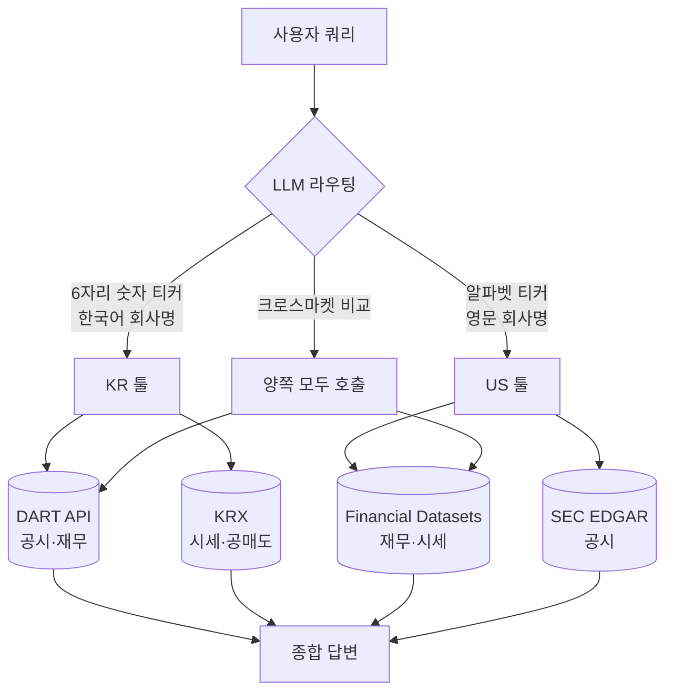
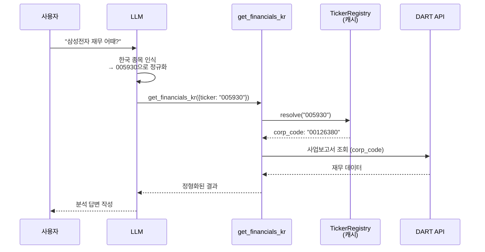

# Dexter 🤖

Dexter는 작업하면서 스스로 사고하고, 계획하고, 학습하는 자율형 금융 리서치 에이전트입니다. 
작업 계획(task planning), 자기 점검(self-reflection), 실시간 시장 데이터를 활용해 분석을 수행합니다. Claude Code를 떠올리되, 금융 리서치에 특화되도록 만들어진 도구라고 생각하면 됩니다.

[](https://twitter.com/virattt) [](https://discord.gg/jpGHv2XB6T)


## 목차

- [👋 개요](#-개요)
- [🇰🇷 한국 주식 리서치](#-한국-주식-리서치)
- [💡 사용 예시](#-사용-예시)
- [🚀 빠른 시작](#-빠른-시작)
- [🔧 더 알아보기](#-더-알아보기)
- [📄 라이선스](#-라이선스)
- [⚠️ 면책 조항](#️-면책-조항)

## 👋 개요

Dexter는 복잡한 금융 질문을 받아 명확한 단계별 리서치 계획으로 바꿉니다. 그 작업을 실시간 시장 데이터로 실행하고, 자신의 작업을 점검하며, 데이터로 뒷받침되는 확신 있는 답에 이를 때까지 결과를 다듬습니다.

**핵심 역량:**
- **지능형 작업 계획**: 복잡한 쿼리를 구조화된 리서치 단계로 자동 분해
- **자율 실행**: 금융 데이터를 수집할 알맞은 툴을 선택해 실행
- **자기 검증**: 자신의 작업을 점검하고 작업이 완료될 때까지 반복
- **실시간 금융 데이터**: 손익계산서·재무상태표·현금흐름표 접근
- **미국·한국 동시 지원**: 하나의 에이전트에서 US/KR 종목을 함께 다루고 교차 비교
- **안전장치**: 무한 루프 감지와 단계 제한을 내장해 폭주 실행 방지

### 아키텍처


## 🇰🇷 한국 주식 리서치

Dexter는 미국 주식과 한국 주식을 **하나의 에이전트에서 동시에** 다룰 수 있습니다. 사용자가 시장을 명시할 필요 없이, LLM이 티커 형태와 회사명 언어를 보고 알맞은 데이터 소스를 골라 호출합니다. (한국 데이터 활성화는 [빠른 시작](#-빠른-시작)의 환경 변수 참고.)

### 동작 방식



### 신규 툴 (DART 기반)

`DART_API_KEY`가 설정되면 자동 등록됩니다.

| 툴 | 대응되는 미국 개념 | 데이터 소스 |
|---|---|---|
| `get_financials_kr` | `get_financials` (10-K/10-Q) | DART 사업·반기·분기보고서 |
| `get_filings_kr` | SEC EDGAR | DART 공시 검색 |
| `get_large_holders_kr` | 13F (5% 이상 보유) | DART 대량보유상황보고서 |
| `get_insider_trades_kr` | Form 4 (내부자 거래) | DART 임원·주요주주 보고 |

### 신규 툴 (Korea-specific, 소스별 키)

DART에 없는 한국 특화 데이터. 툴마다 소스·키가 다릅니다.

| 툴 | 대응되는 미국 개념 | 데이터 소스 | 활성화 조건 |
|---|---|---|---|
| `get_foreign_ownership_kr` | (미국엔 없음) | 외국인 지분율 (Naver) | 항상 (키 불필요) |
| `get_short_balance_kr` | Short interest | KRX 공매도 순보유잔고 | `KRX_ID`+`KRX_PW` 또는 `KRX_COOKIE` |
| `get_nps_holdings` | (미국엔 없음) | 국민연금 국내주식 투자정보 (data.go.kr) | `DATA_GO_KR_SERVICE_KEY` |

### 종목 코드 해결 흐름

LLM이 "삼성전자" 같은 자연어 입력을 받으면, 툴 내부에서 **티커 → corp_code** 변환을 거쳐 DART API를 호출합니다.



`TickerRegistry`는 DART의 마스터 파일(`corpCode.xml`)을 **첫 실행 시 한 번 다운로드**해 `.dexter/cache/`에 저장하고, 7일마다 백그라운드에서 갱신합니다. 신규 상장·사명 변경·물적분할이 자동 반영됩니다.

### 한국 시장 고유 처리

- **K-IFRS 재무제표** — 연결/별도 둘 다 조회. 영업이익 정의가 미국 GAAP와 미묘하게 다름
- **단위** — 원(KRW), 백만원/억/조 단위로 자동 포맷팅
- **거래시간** — 09:00–15:30 KST 기준
- **상하한가** — ±30% 일간 변동 제한 고려
- **DCF 자동 분기** — 6자리 티커면 DCF 스킬이 한국 경로로 전환(한국 법인세율·국고채 무위험금리·KRW). 거래세·배당세는 투자자 세후 실현수익률 주의사항으로 표기
- **재벌 그룹 구조** — 삼성·현대차·SK·LG 등 그룹 내 지분 관계 분석 가능
- **물적분할 분석** — LG화학→LG에너지솔루션 같은 분할 이벤트를 모회사 주주 관점(희석·지주사 디스카운트)에서 평가하는 전용 스킬

## 💡 사용 예시

아래는 Dexter에 바로 던질 수 있는 구체적인 쿼리 예시입니다. 시장(미국/한국)을 따로 지정할 필요 없이, 티커 형태와 언어를 보고 에이전트가 알맞은 툴·스킬로 라우팅합니다.

### 기본 재무 분석

```
> 삼성전자 최근 5년 매출과 영업이익 추세 정리해줘
> 현대차(005380) 연결 기준 잉여현금흐름 5년치 보여줘
> AAPL 최근 4개 분기 영업이익률 추이 알려줘
```

### 밸류에이션 (DCF)

```
> 삼성전자 DCF로 적정주가 계산하고 현재가랑 비교해줘
> 네이버(035420) 내재가치 구하고 WACC·터미널 성장률 민감도표까지 보여줘
> NVDA 적정가치 분석해줘
```

> 6자리 한국 티커면 DCF 스킬이 자동으로 한국 경로(K-IFRS·법인세율·국고채 무위험금리·KRW)로 분기합니다.

### 공시 · 소유구조 (DART)

```
> 카카오 최근 1년 주요 공시 정리해줘
> 삼성전자 5% 이상 대량보유 주주 목록 보여줘
> 에코프로 임원·주요주주 최근 지분 변동 알려줘
```

### 한국 특화 데이터

```
> 에코프로비엠 공매도 순보유잔고 추이 어때?         # KRX 키 필요
> 삼성전자 외국인 지분율 최근 추세 보여줘
> 국민연금이 보유한 삼성전자 지분율 알려줘            # data.go.kr 키 필요
```

### 물적분할 · 이벤트 분석

```
> LG화학 물적분할이 기존 주주가치에 어떤 영향이었는지 분석해줘
> 카카오 자회사 쪼개기 상장이 모회사 주주에 미친 영향 평가해줘
```

### 크로스마켓 비교

```
> TSMC와 삼성전자 파운드리 사업 재무로 비교해줘
> 엔비디아와 SK하이닉스 HBM 관련 실적 비교 분석해줘
```

> 크로스마켓 쿼리는 `get_financials`(US)와 `get_financials_kr`(KR)를 모두 호출하고, 단위·회계기준 차이를 보정해 비교 표를 생성합니다.

### 투자 메모 · 센티먼트

```
> 삼성전자 매수 논거를 투자 메모로 작성해줘
> 테슬라에 대한 X(트위터) 여론 분석해줘
```

> 일부 한국 특화 툴(공매도·국민연금)과 웹/X 검색은 해당 API 키가 설정돼 있어야 동작합니다. [빠른 시작](#-빠른-시작) 참고.

## 🚀 빠른 시작

### 사전 준비

- [Bun](https://bun.com) 런타임 (v1.0 이상)
- **OpenAI API 키** ([발급](https://platform.openai.com/api-keys)) — 또는 다른 LLM 제공자
- **Financial Datasets API 키** ([발급](https://financialdatasets.ai)) — 미국 시장 데이터
- **DART API 키** ([발급](https://opendart.fss.or.kr), 무료, 일 10,000건) — 한국 시장 데이터
- (선택) Exa(웹 검색), KRX·data.go.kr(한국 특화 데이터), X(센티먼트) 키

Bun이 없다면:

```bash
# macOS/Linux
curl -fsSL https://bun.com/install | bash

# Windows
powershell -c "irm bun.sh/install.ps1|iex"
```

설치 후 터미널을 재시작하고 확인: `bun --version`

### 설치

```bash
git clone https://github.com/virattt/dexter.git
cd dexter
bun install
```

### 환경 변수

`env.example`을 복사해 `.env`를 만들고 필요한 키를 채웁니다. (`your-`로 시작하는 값은 미설정으로 간주됩니다.)

```bash
cp env.example .env
```

```bash
# --- LLM (최소 하나 필수) ---
OPENAI_API_KEY=your-openai-api-key
# ANTHROPIC_API_KEY=...                      (선택)
# GOOGLE_API_KEY=...                         (선택)
# XAI_API_KEY=... / OPENROUTER_API_KEY=...   (선택)
# OLLAMA_BASE_URL=http://127.0.0.1:11434     (로컬 LLM)

# --- 미국 시장 데이터 ---
FINANCIAL_DATASETS_API_KEY=your-financial-datasets-api-key

# --- 한국 시장 ---
DART_API_KEY=your-dart-api-key               # 재무·공시 (필수: KR 펀더멘털/공시)
# KRX_ID=your-krx-id                         # 공매도 잔고 (data.krx.co.kr 로그인)
# KRX_PW=your-krx-password
# KRX_COOKIE=JSESSIONID=...;                 # 소셜 로그인 계정은 브라우저 쿠키 붙여넣기
# DATA_GO_KR_SERVICE_KEY=...                 # 국민연금 보유 (data.go.kr, Decoded 키)

# --- 웹 검색 (선택, Exa 우선 → Tavily 폴백) ---
# EXASEARCH_API_KEY=your-exa-api-key
# TAVILY_API_KEY=your-tavily-api-key

# --- X/트위터 센티먼트 (선택) ---
# X_BEARER_TOKEN=your-X-bearer-token
```

### 실행

```bash
bun start      # 대화형 모드
bun dev        # 개발용 watch 모드
```

## 🔧 더 알아보기

### 📊 평가

Dexter에는 금융 질문 데이터셋으로 에이전트를 테스트하는 평가(eval) 스위트가 포함돼 있습니다. 평가는 추적에 LangSmith를, 정답 채점에 LLM-as-judge 방식을 사용합니다.

```bash
bun run src/evals/run.ts              # 전체 질문
bun run src/evals/run.ts --sample 10  # 무작위 샘플 10개
```

평가 러너는 진행 상황, 현재 질문, 실시간 정확도 통계를 보여주는 UI를 실시간으로 표시합니다. 결과는 분석을 위해 LangSmith에 기록됩니다.

### 🐛 디버깅

Dexter는 디버깅과 이력 추적을 위해 모든 툴 호출을 스크래치패드(scratchpad) 파일에 기록합니다. 각 쿼리는 `.dexter/scratchpad/`에 새 JSONL 파일을 생성합니다.

```
.dexter/scratchpad/
├── 2026-01-30-111400_9a8f10723f79.jsonl
├── 2026-01-30-143022_a1b2c3d4e5f6.jsonl
└── ...
```

각 파일은 다음을 추적하는 줄바꿈 구분(JSONL) 항목을 담습니다:
- **init**: 원본 쿼리
- **tool_result**: 인자·원시 결과·LLM 요약을 포함한 각 툴 호출
- **thinking**: 에이전트의 추론 단계

**스크래치패드 항목 예시:**
```json
{"type":"tool_result","timestamp":"2026-01-30T11:14:05.123Z","toolName":"get_income_statements","args":{"ticker":"AAPL","period":"annual","limit":5},"result":{...},"llmSummary":"Retrieved 5 years of Apple annual income statements showing revenue growth from $274B to $394B"}
```

덕분에 에이전트가 정확히 어떤 데이터를 수집했고 결과를 어떻게 해석했는지 손쉽게 확인할 수 있습니다.

## 📄 라이선스

이 프로젝트는 MIT 라이선스로 배포됩니다.

## ⚠️ 면책 조항

이 프로젝트는 **교육·오락·정보 제공 목적으로만** 제공됩니다. 실제 거래나 투자를 위한 것이 아닙니다.

- 금융·투자·세무·법률 자문이 아닙니다
- 정확성·완전성·특정 목적 적합성을 보장하지 않습니다
- 출력 결과가 부정확하거나 불완전하거나 시점이 지난 것일 수 있습니다
- 제작자와 기여자는 어떠한 금전적 손실이나 손해에 대해서도 책임지지 않습니다
- 투자 결정을 내리기 전에 면허를 보유한 금융 전문가와 상담하세요
- 과거 성과가 미래 수익을 보장하지 않습니다

이 소프트웨어를 사용함으로써, 귀하는 학습 및 정보 제공 목적으로만 사용할 것에 동의하며 사용에 따른 모든 위험을 감수합니다.
