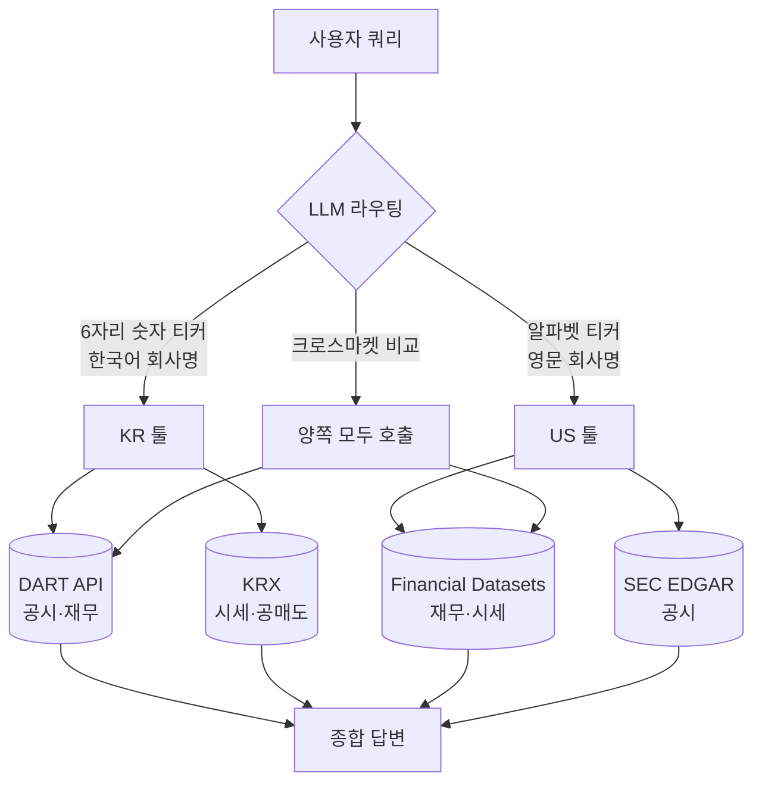
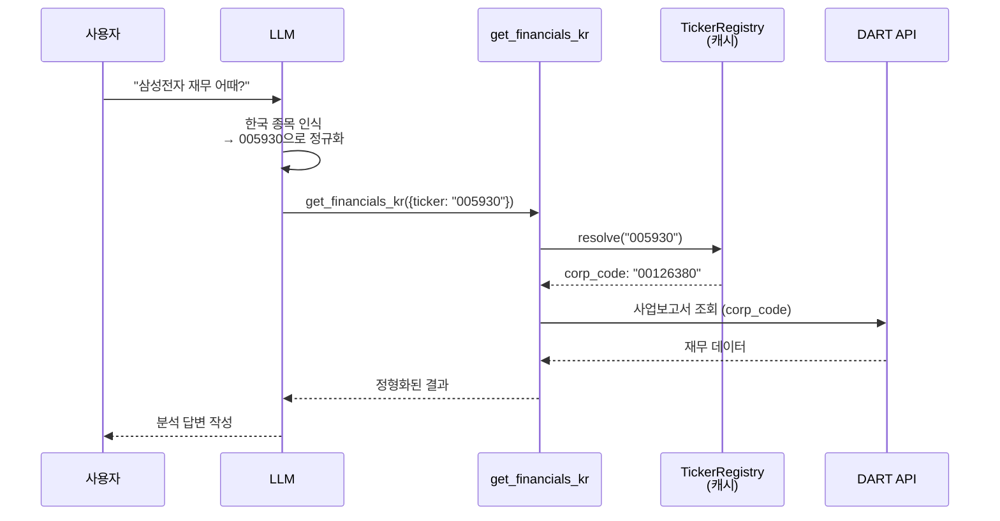

# Dexter 🤖

Dexter is an autonomous financial research agent that thinks, plans, and learns as it works. It performs analysis using task planning, self-reflection, and real-time market data. Think Claude Code, but built specifically for financial research.


## Table of Contents

- [👋 Overview](#-overview)
- [🇰🇷 한국 주식 리서치](#-한국-주식-리서치)
- [✅ Prerequisites](#-prerequisites)
- [💻 How to Install](#-how-to-install)
- [🚀 How to Run](#-how-to-run)
- [📊 How to Evaluate](#-how-to-evaluate)
- [🐛 How to Debug](#-how-to-debug)
- [📱 How to Use with WhatsApp](#-how-to-use-with-whatsapp)
- [🤝 How to Contribute](#-how-to-contribute)
- [📄 License](#-license)

## ⚠️ Disclaimer

This project is for **educational, entertainment, and informational purposes only**. It is not intended for real trading or investment.

- Not financial, investment, tax, or legal advice
- No guarantees of accuracy, completeness, or fitness for any purpose
- Outputs may be incorrect, incomplete, or out of date
- Creator and contributors assume no liability for any financial losses or damages
- Consult a licensed financial advisor before making investment decisions
- Past performance does not indicate future results

By using this software, you agree to use it solely for learning and informational purposes and accept all risks associated with its use.

## 👋 Overview

Dexter takes complex financial questions and turns them into clear, step-by-step research plans. It runs those tasks using live market data, checks its own work, and refines the results until it has a confident, data-backed answer.  

**Key Capabilities:**
- **Intelligent Task Planning**: Automatically decomposes complex queries into structured research steps
- **Autonomous Execution**: Selects and executes the right tools to gather financial data
- **Self-Validation**: Checks its own work and iterates until tasks are complete
- **Real-Time Financial Data**: Access to income statements, balance sheets, and cash flow statements
- **Safety Features**: Built-in loop detection and step limits to prevent runaway execution

[](https://twitter.com/virattt) [](https://discord.gg/jpGHv2XB6T)


## 🇰🇷 한국 주식 리서치

Dexter는 미국 주식과 한국 주식을 **하나의 에이전트에서 동시에** 다룰 수 있습니다. 사용자가 시장을 명시할 필요 없이, LLM이 티커 형태와 회사명 언어를 보고 알맞은 데이터 소스를 골라 호출합니다.

### 동작 방식



### 신규 툴 (DART 기반)

`OPEN_DART_KEY`가 설정되면 자동 등록됩니다.

| 툴 | 대응되는 미국 개념 | 데이터 소스 |
|---|---|---|
| `get_financials_kr` | `get_financials` (10-K/10-Q) | DART 사업·반기·분기보고서 |
| `get_filings_kr` | SEC EDGAR | DART 공시 검색 |
| `get_large_holders_kr` | 13F (5% 이상 보유) | DART 대량보유상황보고서 |
| `get_insider_trades_kr` | Form 4 (내부자 거래) | DART 임원·주요주주 보고 |
| `get_nps_holdings` | (미국엔 없음) | 국민연금 분기 공시 |
| `get_short_balance_kr` | Short interest | KRX 공매도 잔고 |
| `get_foreign_ownership_kr` | (미국엔 없음) | KRX 외국인 지분율 |

### 종목 코드 해결 흐름

LLM이 "삼성전자" 같은 자연어 입력을 받으면, 툴 내부에서 **티커 → corp_code** 변환을 거쳐 DART API를 호출합니다.



`TickerRegistry`는 DART의 마스터 파일(`corpCode.xml`)을 **첫 실행 시 한 번 다운로드**해 `.dexter/cache/`에 저장하고, 7일마다 백그라운드에서 갱신합니다. 신규 상장·사명 변경·물적분할이 자동 반영됩니다.

### 설정

`.env`에 다음 항목 추가:

```bash
# 한국 주식 (필수)
OPEN_DART_KEY=your-dart-api-key
```

DART API 키는 [opendart.fss.or.kr](https://opendart.fss.or.kr/uss/umt/cmm/EgovMberInsertView.do)에서 무료 발급. 일 10,000건 호출 한도.

### 한국 시장 고유 처리

- **K-IFRS 재무제표** — 연결/별도 둘 다 조회. 영업이익 정의가 미국 GAAP와 미묘하게 다름
- **단위** — 원(KRW), 백만원/억/조 단위로 자동 포맷팅
- **거래시간** — 09:00–15:30 KST 기준
- **상하한가** — ±30% 일간 변동 제한 고려
- **재벌 그룹 구조** — 삼성·현대차·SK·LG 등 그룹 내 지분 관계 분석 가능
- **물적분할 이력** — LG화학→LG에너지솔루션 같은 분할 이벤트 추적

### 크로스마켓 쿼리 예시

```
> TSMC와 삼성전자 파운드리 사업 비교해줘
```

LLM이 `get_financials` (TSMC, US) + `get_financials_kr` (삼성전자, KR)를 모두 호출하고, 단위·회계기준 차이를 보정해서 비교 표를 생성합니다.


## ✅ Prerequisites

- [Bun](https://bun.com) runtime (v1.0 or higher)
- OpenAI API key (get [here](https://platform.openai.com/api-keys))
- Financial Datasets API key (get [here](https://financialdatasets.ai))
- Exa API key (get [here](https://exa.ai)) - optional, for web search

#### Installing Bun

If you don't have Bun installed, you can install it using curl:

**macOS/Linux:**
```bash
curl -fsSL https://bun.com/install | bash
```

**Windows:**
```bash
powershell -c "irm bun.sh/install.ps1|iex"
```

After installation, restart your terminal and verify Bun is installed:
```bash
bun --version
```

## 💻 How to Install

1. Clone the repository:
```bash
git clone https://github.com/virattt/dexter.git
cd dexter
```

2. Install dependencies with Bun:
```bash
bun install
```

3. Set up your environment variables:
```bash
# Copy the example environment file
cp env.example .env

# Edit .env and add your API keys (if using cloud providers)
# OPENAI_API_KEY=your-openai-api-key
# ANTHROPIC_API_KEY=your-anthropic-api-key (optional)
# GOOGLE_API_KEY=your-google-api-key (optional)
# XAI_API_KEY=your-xai-api-key (optional)
# OPENROUTER_API_KEY=your-openrouter-api-key (optional)

# Institutional-grade market data for agents
# FINANCIAL_DATASETS_API_KEY=your-financial-datasets-api-key

# (Optional) If using Ollama locally
# OLLAMA_BASE_URL=http://127.0.0.1:11434

# Web Search (Exa preferred, Tavily fallback)
# EXASEARCH_API_KEY=your-exa-api-key
# TAVILY_API_KEY=your-tavily-api-key
```

## 🚀 How to Run

Run Dexter in interactive mode:
```bash
bun start
```

Or with watch mode for development:
```bash
bun dev
```

## 📊 How to Evaluate

Dexter includes an evaluation suite that tests the agent against a dataset of financial questions. Evals use LangSmith for tracking and an LLM-as-judge approach for scoring correctness.

**Run on all questions:**
```bash
bun run src/evals/run.ts
```

**Run on a random sample of data:**
```bash
bun run src/evals/run.ts --sample 10
```

The eval runner displays a real-time UI showing progress, current question, and running accuracy statistics. Results are logged to LangSmith for analysis.

## 🐛 How to Debug

Dexter logs all tool calls to a scratchpad file for debugging and history tracking. Each query creates a new JSONL file in `.dexter/scratchpad/`.

**Scratchpad location:**
```
.dexter/scratchpad/
├── 2026-01-30-111400_9a8f10723f79.jsonl
├── 2026-01-30-143022_a1b2c3d4e5f6.jsonl
└── ...
```

Each file contains newline-delimited JSON entries tracking:
- **init**: The original query
- **tool_result**: Each tool call with arguments, raw result, and LLM summary
- **thinking**: Agent reasoning steps

**Example scratchpad entry:**
```json
{"type":"tool_result","timestamp":"2026-01-30T11:14:05.123Z","toolName":"get_income_statements","args":{"ticker":"AAPL","period":"annual","limit":5},"result":{...},"llmSummary":"Retrieved 5 years of Apple annual income statements showing revenue growth from $274B to $394B"}
```

This makes it easy to inspect exactly what data the agent gathered and how it interpreted results.

## 📱 How to Use with WhatsApp

Chat with Dexter through WhatsApp by linking your phone to the gateway. Messages you send to yourself are processed by Dexter and responses are sent back to the same chat.

**Quick start:**
```bash
# Link your WhatsApp account (scan QR code)
bun run gateway:login

# Start the gateway
bun run gateway
```

Then open WhatsApp, go to your own chat (message yourself), and ask Dexter a question.

For detailed setup instructions, configuration options, and troubleshooting, see the [WhatsApp Gateway README](src/gateway/channels/whatsapp/README.md).

## 🤝 How to Contribute

1. Fork the repository
2. Create a feature branch
3. Commit your changes
4. Push to the branch
5. Create a Pull Request

**Important**: Please keep your pull requests small and focused.  This will make it easier to review and merge.


## 📄 License

This project is licensed under the MIT License.
